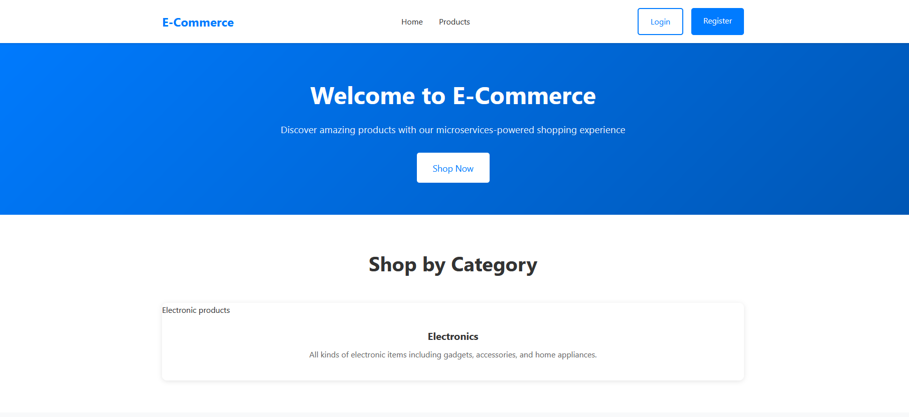
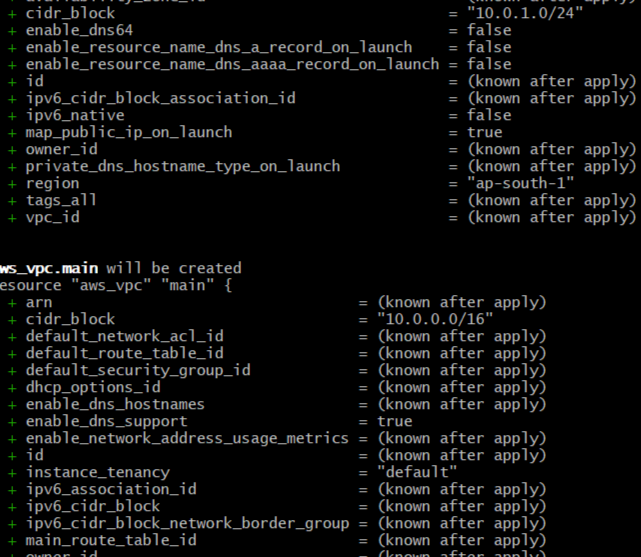

## Overview

Goal:

Containerize 5 Node.js services (user, products, orders, cart, frontend).

Host them on AWS EC2 using Docker.

Provision everything with Terraform.

All services use Docker images built and pushed to DockerHub.

The frontend must be publicly accessible.

Step 1: Application & Docker Setup (Manual)

1. Clone the Repository

  Confirm you see the 5 services as folders.

2. Create Dockerfiles
For each service (example: user):

  Navigate to the service directory:

  Create a Dockerfile.

  Adjust EXPOSE:

user: 3001

products: 3002

orders: 3003

cart: 3004

frontend: 3000

Repeat for each service.

3. Minimal Route for Service Health
In each service's main file, add a health check route:

4. Build & Test Images Locally
From each service directory:
(Repeat for all services and ports.)

5. Push Docker Images to DockerHub

Step 2: Terraform AWS Provisioning

1. Project Structure
text
terraform/
  main.tf
  outputs.tf
  providers.tf
  terraform.tfvars
  variables.tf

Step 3: Deploy with Terraform

cd terraform
terraform init
terraform apply -auto-approve

Wait for completion—Terraform shows your public IP.

Step 4: Verification

Go to the printed URL (e.g., http://<public-ip>) to check frontend service.

SSH into EC2 and run docker ps to verify all containers.

Use curl http://localhost:3001/health on EC2 to verify backend containers.

